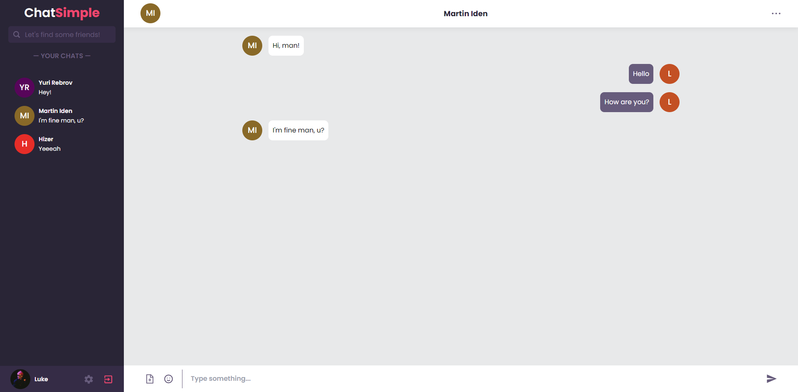

# Welcome to the Chat App!

Main page

# This project has the following features:
 - Login/Register an account;
 - Find friends using search;
 - Write messages;
 
 And of course the app is fully responsive for different devices!🔥
 
 ## Stack
 - [Vite+React](https://vitejs.dev/) - Vite is a build tool that aims to provide a faster and leaner development experience for modern web projects
 - [Tailwindcss](https://tailwindcss.com/) - Tailwind CSS is an open source CSS framework
 - [ChakraUI](https://chakra-ui.com/) - Chakra UI is a simple, modular and accessible component library that gives you the building blocks you need to build your React applications
 - [Firebase](https://firebase.google.com/) - Firebase is an app development platform that helps you build and grow apps and games users love. Backed by Google and trusted by millions of businesses around the world
